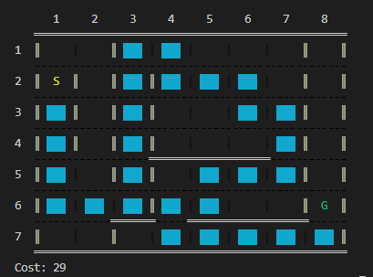
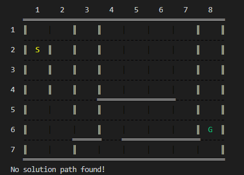

# Maze Solver
Find solution path from start to goal in the maze using 
[A* Algorithm](https://en.wikipedia.org/wiki/A*_search_algorithm) with 
[Manhattan Distance](https://en.wikipedia.org/wiki/Taxicab_geometry) Heuristic.

## How to run?
<code>pip install colorama</code>
 
<code>python -m lib</code>

## How to use?
After run project, You can create your n*m maze with following options:
- set start
- set goal
- add wall
- remove wall

then see solution path.

## Examples

