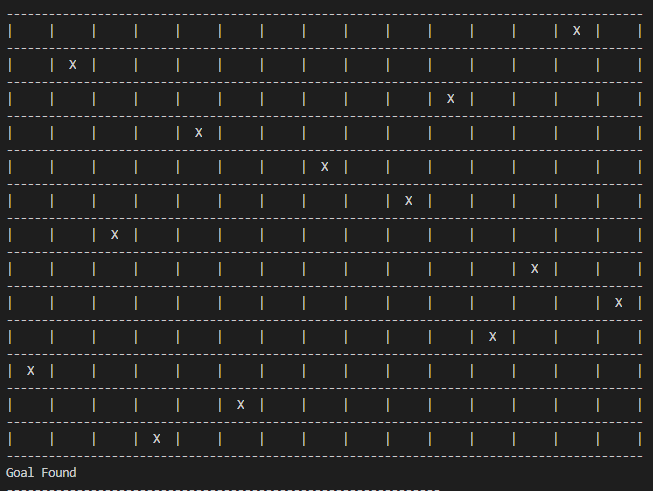

# N Queen Solver
We want to find an arrangement of N queens on an N*N chess board, such that no queen can attack any other queens on the board.

To solve it, we used the local search algorithm [Simulated Annealing](https://en.wikipedia.org/wiki/Simulated_annealing), so it may not return the correct answer.

## How to run?
<code>python -m lib</code>

## How to use?
After run project, You just need to set number of queens (size of chess board).
 
If it does not return the correct answer, you can use the following options:
- Restart : Runs the algorithm again
- Sequential Restart : Runs the algorithm sequential to find answer

## Examples

